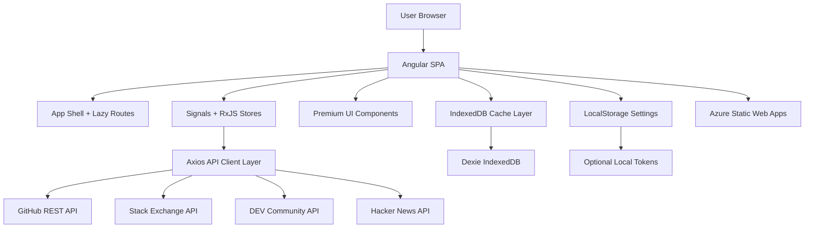

# DevPulse AI — Architecture Overview

DevPulse AI is a frontend-only developer intelligence dashboard built with Angular, RxJS, Tailwind CSS, Axios, IndexedDB, and public APIs.

The application intentionally avoids custom backend infrastructure. All data orchestration, caching, state management, and user preferences are handled in the browser.

## Architecture Principles

- Frontend-only architecture
- Public/Open APIs only
- No custom backend
- No server-side database
- Browser-first persistence using IndexedDB and LocalStorage
- Route-level lazy loading
- RxJS-based data orchestration
- Axios-based API abstraction
- Production-grade error handling
- Azure Static Web Apps deployment

## High-Level Architecture

